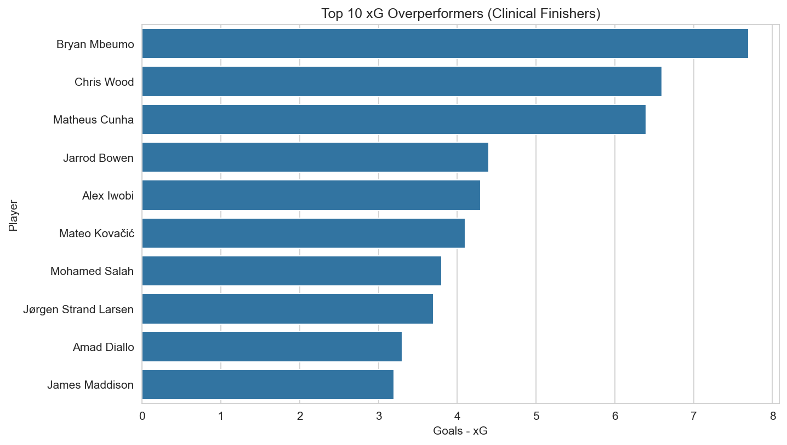

# EPL Player Stats 2024-25: xG Overperformance Analysis

## 📊 Project Overview
Analysis of 562 English Premier League players from the 2024-25 season, focusing on **Expected Goals (xG) overperformance** to identify the most clinical finishers in the league.

**Key Question**: Which players are scoring more goals than their xG suggests they "should"?

---

## ⚽ What is Expected Goals (xG)?

Expected Goals (xG) is a football analytics metric that estimates how likely a shot
is to result in a goal based on factors such as shot location, angle, and situation.
Each shot is assigned a value between 0 and 1, where higher values represent better
scoring chances.

For example, a tap-in from close range has a high xG of ~ 0.85, while a long-distance shot
under pressure has a low xG, something like 0.14.

---

## 📊 Dataset
- Season: 2024–25 EPL
- Source: FBREF Premier league 2024/25 player stats dataset
- Filter: Players with at least 900 minutes played (10 matches)
- 
---

##  💭 Methodology
- Defined clinical finishing as: Goals − xG
- Used Python (pandas) for data cleaning, filtering, and visualization
- Replicated analysis using SQL (SQLite) for validation

---

## 🎯 Key Findings
- Top clinical finisher: Bryan Mbuemo
- Least Clinical finisher: Savio
- Team with most efficient finishers: Nottingham Forest

---

## 📁 Repository Structure
```
epl-player-stats-24-25/
│── data/                   # Raw dataset
│── notebooks/              # Jupyter notebook with analysis
│── sql/                    # SQL queries
│── visuals/                # Charts and graphs
│── README.md
```

---

## 🛠️ Tools & Libraries
- **Python**: pandas, matplotlib, seaborn, plotly
- **SQL**: SQLite for querying
- **Data Source**: Premier league 2024/25 player stats from Kaggle

---

## 📈 Visualizations
1. Top 10 xG Overperformers:
   
2. xG vs. Actual Goals: (hover to view player details)
   [View interactive chart](https://kumarrr15.github.io/epl-player-stats-24-25/xg_vs_goals_interactive.html)

---

## 📊Interactive Dashboard

View the interactive Tableau dashboard here:  
[Tableau Public – EPL Player Finishing Analysis]([View_Interactive_Dashboard](https://public.tableau.com/views/EPLPlayerFinishingAnalysis202425/EPLPlayerFinishingAnalysisGoalsxG?:language=en-US&publish=yes&:sid=&:redirect=auth&:display_count=n&:origin=viz_share_link))


---

## 🚀 How to Run
```bash
# Clone repo
git clone https://github.com/kumarrr15/epl-player-stats-24-25.git
cd epl-player-stats-24-25

# Install dependencies
pip install pandas matplotlib seaborn jupyter plotly

# Run notebook
jupyter notebook notebooks/analysis.ipynb
```

---

## 👤 Author
Kumar Duvvapu | Data Sciences Sophomore @ Penn State

---

## 📅 Last Updated
January 2026
